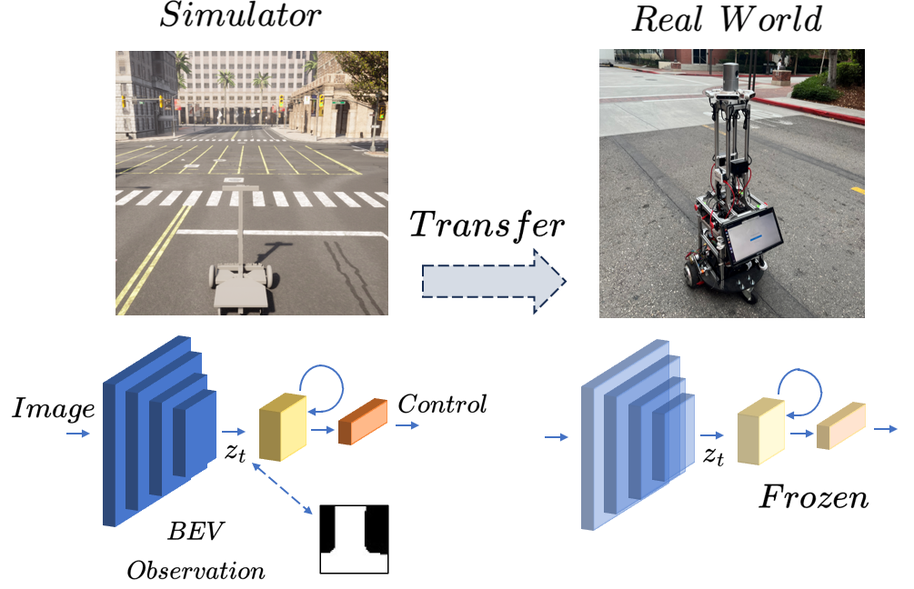
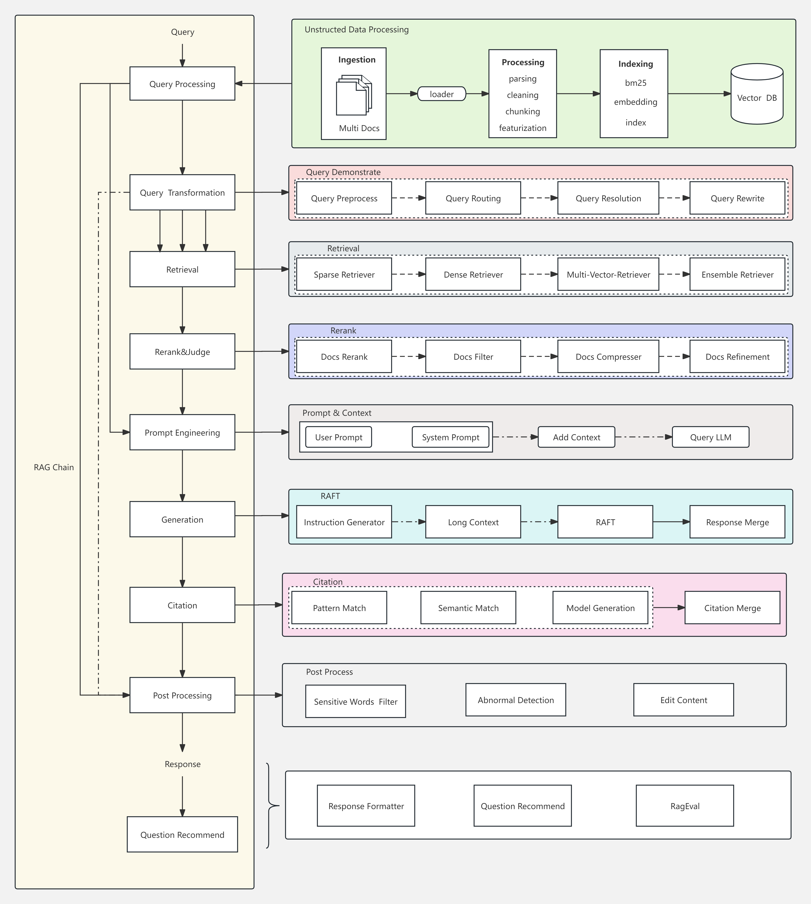
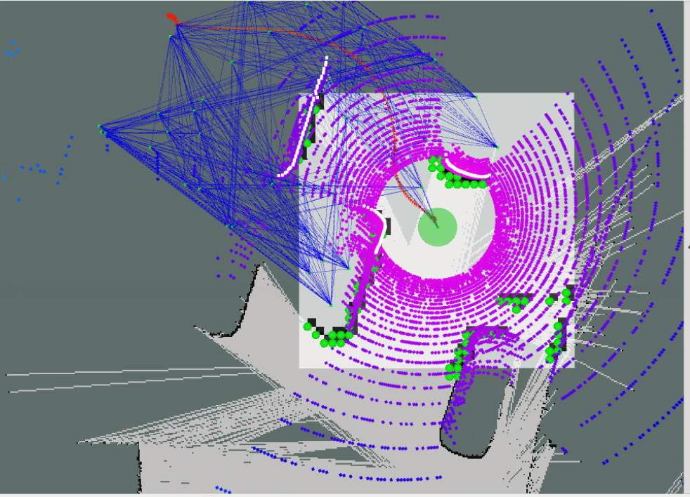
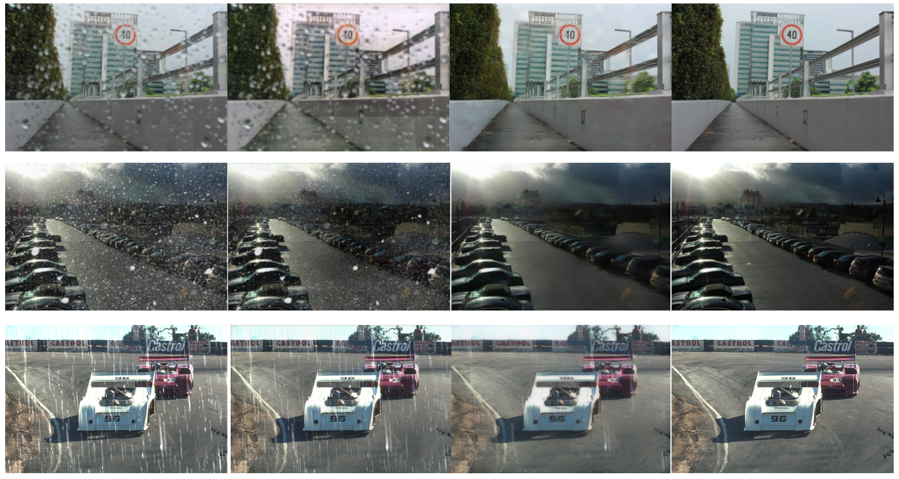

I am currently a first-year PhD student at CU Boulder, advised by [Prof. Nikolaus Correll](https://www.colorado.edu/cs/nikolaus-correll) and [Prof. Alessandro Roncone](https://www.colorado.edu/cs/alessandro-roncone).

My research goal is to build intelligent agents that can efficiently learn to understand and interact with our world. My work bridges two critical areas:
1) **Agent Learning:** Improving the generalization and sample efficiency of reinforcement learning for robotic tasks like visual navigation and manipulation.
2) **Foundational Models:** Scaling the inference of pre-trained models (e.g., Large Language Models or Vision-Language-Action Models) to serve as the knowledge backbone for these agents.

Previously, I worked for 2 years as a Research Engineer at the Chinese Academy of Sciences (CAS), supervised by [Prof. Jiafeng Guo](https://scholar.google.com/citations?user=nD0I3PUAAAAJ&hl=en). I earned my M.S. in Computer Science from the University of Southern California (USC), where I was advised by [Prof. Laurent Itti](http://ilab.usc.edu/itti/), and my Bachelor's in Computer Science from Central South University (CSU) and Western University (UWO) through a 2+2 dual degree program.

You can find my CV here: [Chen's Curriculum Vitae](../assets/Chen_Liu_Resume.pdf). <small><em>(Last updated: 2023)</em></small>

## Research
*\* denotes equal contribution.*

  

    
  

  

    <a href="https://arxiv.org/abs/2310.18847"><strong>Bird’s Eye View Based Pretrained World Model for Visual Navigation</strong></a> 
    Kiran Lekkala*, <strong>Chen Liu*</strong>, Laurent Itti 
    <em>International Symposium on Robotics Research (ISRR), 2024.</em> 
    <em>Also presented at the NeurIPS 2023 Robot Learning Workshop.</em> 
    We propose a robust system that integrates the control policy with a pretrained visual perception model and an LSTM-based world model, facilitating seamless application of the policy in real-world scenarios.
  

  

    
  

  

    <a href="https://klekkala.github.io/files/uscilab3d.pdf"><strong>USCILab3D Dataset: A Large-scale, Long-term, Semantic, Outdoor 3D Dataset</strong></a> 
    Kiran Lekkala*, Henghui Bao*, Piexu Cai, Kevin Lim, <strong>Chen Liu</strong>, Laurent Itti 
    <em>Neural Information Processing Systems (NeurIPS), 2024.</em> 
    <em>Accepted into the Open X-Embodiment Collaboration.</em> 
    We propose a novel pipeline that uses foundational models to annotate 3D pointclouds. We also release a large-scale 3D dataset, consisting of images and pointclouds, that is collected over a year in a campus-scale environment.
  

  

    
  

  

    <strong>Facilitating Diverse Manipulation with Vision-Language Model</strong> 
    <strong>Chen Liu</strong>, Sumedh Sontakke, Laurent Itti 
    <em>Preprint</em> 
    We introduce a multi-task robotic system that empowers robots to perform long-horizon manipulation tasks by mimicking a human demonstration video.
  

## Experience

  

    
  

  

    <a href="https://github.com/gomate-community/TrustRAG"><strong>TrustRAG Project - Chinese Academy of Sciences</strong></a>&nbsp; 
    <em>Research Engineer (2023 - 2025)</em>
    <ul style="padding-left: 20px; margin-top: 8px;">
    Led the design and development of TrustRAG, a configurable and modular Retrieval-Augmented Generation (RAG) framework. Engineered the system to ensure reliable inputs and trusted outputs, providing high-quality results for QA tasks.
    </ul>
  

  

    
  

  

    <a href="https://gomall.xir.cn/#/home/project"><strong>XIR Project - Chinese Academy of Sciences</strong></a> 
    <em>Research Engineer (2023 - 2025)</em>
    <ul style="padding-left: 20px; margin-top: 8px;">
      <li>Co-led the architecture and development of a comprehensive LLMOps platform to streamline the end-to-end model lifecycle, from training to production.</li>
      <li>Engineered a high-throughput, auto-scaling model deployment system using vLLM, Ray Serve, and Kubernetes (K8S), enabling low-latency inference and efficient resource management under dynamic loads.</li>
      <li>Developed and integrated two advanced model training frameworks into the platform: A distributed training system leveraging DeepSpeed to efficiently train models with billions of parameters (e.g., 671B DeepSeek R1) across multiple GPU nodes; A versatile, multi-modal fine-tuning system based on LlamaFactory, empowering researchers to develop and experiment with vision-language models.</li>
    </ul>
  

## Selected Projects

  

    
  

  

    <a href="https://github.com/crellian/Schoomatic"><strong>Schoomatic - A Differential-Drive Robot Simulator</strong></a> 
    A robot simulator built on CARLA/Unreal Engine 4, featuring NPC traffic, variable weather, and global waypoint planning. Provides integration with the <a href="https://github.com/crellian/schoomatic_visnav">RLLib</a> reinforcement learning framework and <a href="https://github.com/klekkala/ros_prtr_visualnav">ROS</a>.
  

  

    
  

  

    <a href="https://github.com/klekkala/ros_prtr_visualnav"><strong>Schoomatic Autopilot</strong></a> 
    An implementation of a ROS-based end-to-end robot navigation system, including A* global path planning, GMapping SLAM, LiDAR-based occupancy grid mapping, Timed-Elastic-Band (TEB) local planner, and PD motion control.
  

  

    
  

  

    <a href="../assets/weather.pdf"><strong>Deep Learning-based Image Bad Weather Removal</strong></a> 
    We improve the state-of-the-art model TransWeather to restore images degraded by different weather conditions by comparing attention mechanisms and designing a cascaded model to improve performance in heavy rain.
  

  

    
  

  

    <a href="https://github.com/crellian/CVLab"><strong>CVLab</strong></a> 
    A computer vision library built from scratch, including a template Matrix class with reference counting, matrix operations, various image filters (linear, nonlinear, morphological, Gabor), image pyramids, and more.
  

## Invited Talks
* University of Electronic Science and Technology of China (UESTC)
* Shenzhen Technology University (SZTU)
* University of Chinese Academy of Sciences (UCAS)

## Teaching Assistant
CSCI3302 Introduction to Robotics at CU Boulder
