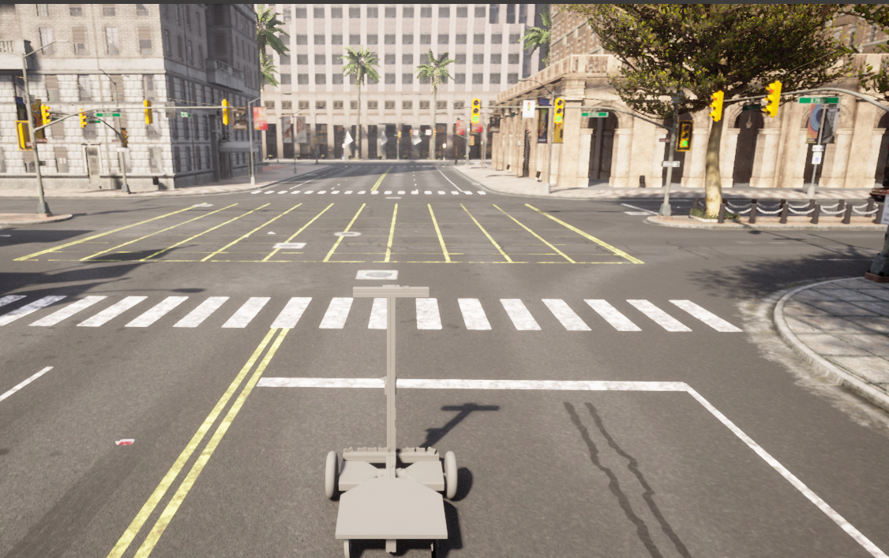

I am currently a first-year PhD student at the University of Colorado Boulder, advised by [Prof. Nikolaus Correll](https://www.colorado.edu/cs/nikolaus-correll) and [Prof. Alessandro Roncone](https://www.colorado.edu/cs/alessandro-roncone).

My research focuses on building intelligent agents that can efficiently learn to understand and interact with our world. My work bridges two critical areas:
1) **Agent Learning:** Improving the generalization and sample efficiency of reinforcement learning for robotic tasks like visual navigation and manipulation.
2) **Foundational Models:** Scaling the inference of pre-trained models (e.g., Large Language and Vision-Language Models) to serve as the knowledge backbone for these agents.

Previously, I worked for 2 years as a Research Engineer at the Chinese Academy of Sciences, supervised by [Prof. Jiafeng Guo](https://scholar.google.com/citations?user=nD0I3PUAAAAJ&hl=en). I earned my M.S. in Computer Science from the University of Southern California, where I was advised by [Prof. Laurent Itti](http://ilab.usc.edu/itti/).

You can find my CV here: [Chen's Curriculum Vitae](../assets/Chen_Liu_Resume.pdf).

## Research
*\* denotes equal contribution.*

<table>
  <tr>
    <td style="width: 180px; padding-right: 20px; vertical-align: top;">
      
    </td>
    <td style="vertical-align: top;">
      <a href="https://arxiv.org/abs/2310.18847"><strong>Bird’s Eye View Based Pretrained World model for Visual Navigation</strong></a> 
      Kiran Lekkala*, <strong>Chen Liu*</strong>, Laurent Itti 
      <em>International Symposium on Robotics Research (ISRR), 2024.</em> 
      <em>Also presented at the NeurIPS 2023 Robot Learning Workshop.</em> 
      We propose a robust system that integrates the control policy with a pretrained visual perception model and an LSTM-based world model, facilitating seamless application in real-world scenarios.
    </td>
  </tr>
  <tr>
    <td style="width: 180px; padding-right: 20px; vertical-align: top;">
      
    </td>
    <td style="vertical-align: top;">
      <a href="https://klekkala.github.io/files/uscilab3d.pdf"><strong>USCILab3D Dataset: A Large-scale, Long-term, Semantic, Outdoor 3D Dataset</strong></a> 
      Kiran Lekkala*, Henghui Bao*, Piexu Cai, Kevin Lim, <strong>Chen Liu</strong>, Laurent Itti 
      <em>Neural Information Processing Systems (NeurIPS), 2024.</em> 
      <em>Accepted into the Open X-Embodiment Collaboration.</em> 
      We propose a novel pipeline that uses foundational models to annotate 3D pointclouds. We also release a large-scale 3D dataset, collected over a year in a campus environment.
    </td>
  </tr>
  <tr>
    <td style="width: 180px; padding-right: 20px; vertical-align: top;">
      
    </td>
    <td style="vertical-align: top;">
      <strong>Facilitating Diverse Manipulation with Vision-Language Model</strong> 
      <strong>Chen Liu</strong>, Sumedh Sontakke, Laurent Itti 
      <em>Preprint</em> 
      We introduce a multi-task robotic system that empowers robots to perform long-horizon manipulation tasks by mimicking a human demonstration video.
    </td>
  </tr>
</table>

## Selected Projects

<table>
  <tr>
    <td style="width: 180px; padding-right: 20px; vertical-align: top;">
      
    </td>
    <td style="vertical-align: top;">
      <a href="https://github.com/gomate-community/TrustRAG"><strong>TrustRAG: A RAG Framework for Reliable and Trusted Output</strong></a> 
      TrustRAG is a configurable and modular Retrieval-Augmented Generation (RAG) framework designed to ensure users obtain high-quality and trustworthy results in retrieval-based QA scenarios.
    </td>
  </tr>
  <tr>
    <td style="width: 180px; padding-right: 20px; vertical-align: top;">
      
    </td>
    <td style="vertical-align: top;">
      <a href="https://github.com/crellian/Schoomatic"><strong>Schoomatic - A Differential-Drive Robot Simulator</strong></a> 
      A robot simulator built on CARLA/Unreal Engine 4, featuring NPC traffic, variable weather, and global waypoint planning. Provides integration with the <a href="https://github.com/crellian/schoomatic_visnav">RLLib</a> reinforcement learning framework and <a href="https://github.com/crellian/Schoomatic-Autopilot">ROS</a>.
    </td>
  </tr>
  <tr>
    <td style="width: 180px; padding-right: 20px; vertical-align: top;">
      
    </td>
    <td style="vertical-align: top;">
      <a href="https://github.com/crellian/Schoomatic-Autopilot"><strong>Schoomatic Autopilot</strong></a> 
      An implementation of a ROS-based end-to-end robot navigation system, including A* global path planning, GMapping SLAM, LiDAR-based occupancy grid mapping, Timed-Elastic-Band (TEB) local planner, and PD motion control.
    </td>
  </tr>
  <tr>
    <td style="width: 180px; padding-right: 20px; vertical-align: top;">
      
    </td>
    <td style="vertical-align: top;">
      <a href="../assets/weather.pdf"><strong>Deep Learning-based Image Bad Weather Removal</strong></a> 
      We improve the state-of-the-art model TransWeather to restore images degraded by different weather conditions by comparing attention mechanisms and designing a cascaded model to improve performance in heavy rain.
    </td>
  </tr>
  <tr>
    <td style="width: 180px; padding-right: 20px; vertical-align: top;">
      
    </td>
    <td style="vertical-align: top;">
      <a href="https://github.com/crellian/CVLab"><strong>CVLab</strong></a> 
      A computer vision library built from scratch, including a template Matrix class with reference counting, matrix operations, various image filters (linear, nonlinear, morphological, Gabor), image pyramids, and more.
    </td>
  </tr>
</table>

## Experience

<table>
  <tr>
    <td style="width: 180px; padding-right: 20px; vertical-align: top;">
      
    </td>
    <td style="vertical-align: top;">
      <a href="https://gomall.xir.cn/#/home/project"><strong>XIR - Chinese Academy of Sciences</strong></a> 
      <em>Research Engineer (2023 - 2025)</em>
      <ul>
        <li>Co-led the architecture and development of a comprehensive LLMOps platform to streamline the end-to-end model lifecycle.</li>
        <li>Engineered an auto-scaling, Kubernetes-based inference system using vLLM and Ray for high-availability and low-latency deployment of production models.</li>
        <li>Developed a robust, distributed training platform using DeepSpeed for massive-scale models and deployed a LlamaFactory-based system for user-friendly multi-modal fine-tuning.</li>
      </ul>
    </td>
  </tr>
</table>

## Invited Talks
* University of Electronic Science and Technology of China (UESTC)
* Shenzhen Technology University (SZTU)
* University of Chinese Academy of Sciences (UCAS)
